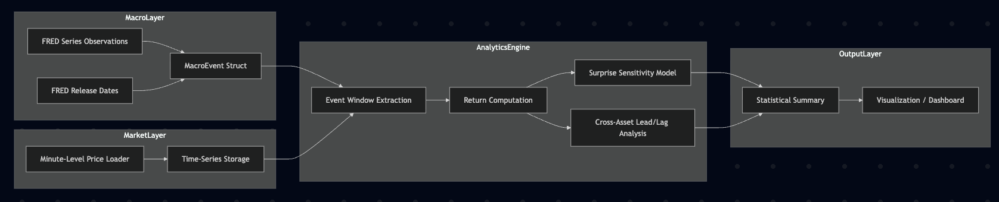
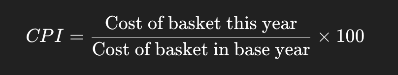

# Real-Time-Macro-Event-Impact-Tracker

## What this Project is doing?
This is a Go application that tracks how macroeconomic events (like CPI releases) impact financial markets in real time. The core idea:

- Fetch macro data — Pull CPI (Consumer Price Index) observations & release dates from the FRED API (Federal Reserve Economic Data).
- Fetch market data — Pull real-time/minute-level prices for assets like SPY, EURUSD, VIX.
- Analyze impact — Around each CPI release, extract a time window of market prices, compute returns, and model how the "surprise" (actual vs. expected) drives price changes.
- Output results — Generate statistical summaries and visualizations.

## Architecture

## Step1. Defining Assets to Track
We track 4 asset classes:
- Equities(SPY (S&P 500 ETF))
- FX (DXY or EURUSD)
- Rates (US 2Y Treasury yield, US 10Y Treasury yield)
- Volatility(VIX)

## What is CPI data? (Consumer Price Index data.)
It measures the average change over time in prices paid by consumers for goods and services.
In simple terms : CPI tells us how expensive life is becoming

CPI tracks price changes in common categories like:

Lets take an example of a basket

- If CPI increases → Inflation
- If CPI decreases → Deflation

## Explaination of FetchMarketData() in market/fetch.go

- Fetches market data, For multiple assets, At the same time (concurrently), And waits until all are done

## Difference between FredSeries data and FredReleaseDate data?
- FredSeries = Economic Time Series Data(The historical inflation values.)
- FredRelease = These are the days when CPI was released to the public.