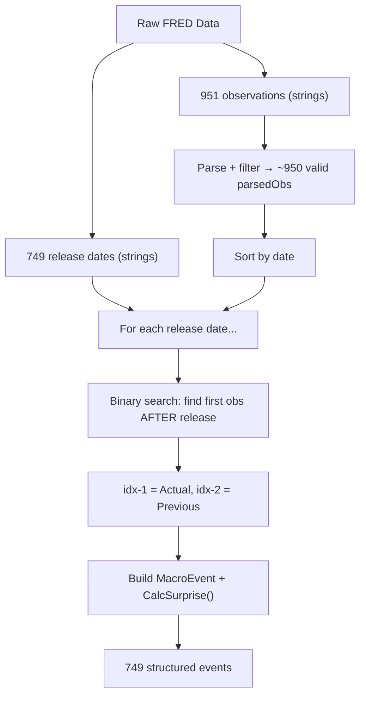
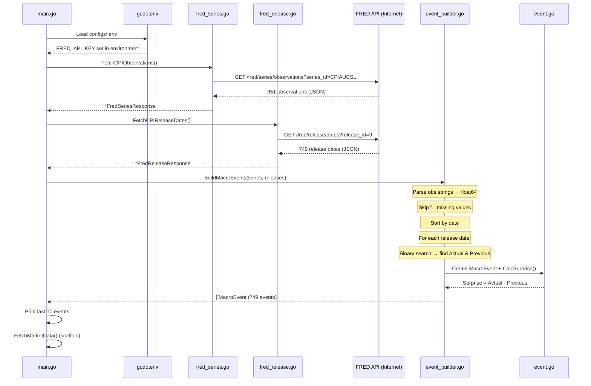

# Phase 1 Deep Dive — Everything Explained

## Table of Contents
1. [The Problem We're Solving](#the-problem-were-solving)
2. [The Two Data Sources We Had](#the-two-data-sources-we-had)
3. [File 1: event.go — The MacroEvent Struct](#file-1-eventgo)
4. [File 2: event_builder.go — The Core Logic](#file-2-event_buildergo)
5. [File 3: event_builder_test.go — The Tests](#file-3-event_builder_testgo)
6. [File 4: main.go — Wiring It All Together](#file-4-maingo)
7. [The Full Data Flow End-to-End](#the-full-data-flow-end-to-end)

---

## The Problem We're Solving

Before Phase 1, you had **two separate pieces of data** that lived in complete isolation:

```
FRED Series API  →  ["2025-01-01": 310.2, "2025-02-01": 312.5, "2025-03-01": 315.0, ...]
                     (CPI values — what inflation actually was each month)

FRED Release API →  ["2025-02-12", "2025-03-12", "2025-04-10", ...]
                     (dates when the government announced CPI to the world)
```

These two datasets are **different things**:
- **Series** = "What was the CPI value?" (the actual number)
- **Release** = "When did the public find out?" (the announcement date)

**The problem**: Markets don't react when CPI is *measured*. They react when CPI is *announced*. So we need to **merge** these two datasets — for each announcement date, figure out which CPI value was being announced, and what the previous value was, so we can calculate the "surprise."

That's what `BuildMacroEvents()` does.

---

## The Two Data Sources We Had

### Source 1: `fred_series.go` — CPI Values

This file was already written. It calls:
```
https://api.stlouisfed.org/fred/series/observations?series_id=CPIAUCSL&api_key=...
```

And returns data like:
```json
{
  "observations": [
    {"date": "2025-01-01", "value": "310.231"},
    {"date": "2025-02-01", "value": "312.548"},
    {"date": "2025-03-01", "value": "."},        ← FRED uses "." for missing data!
    {"date": "2025-04-01", "value": "315.055"}
  ]
}
```

> [!IMPORTANT]
> Key detail: the `date` is the **first day of the measurement month**, NOT the release date. CPI for January is dated "2025-01-01" but isn't released until mid-February.

> [!WARNING]
> Another gotcha: the `value` field is a **string**, not a number. And FRED uses a literal `"."` to represent missing data. We need to handle both.

### Source 2: `fred_release.go` — Announcement Dates

Also already written. It calls:
```
https://api.stlouisfed.org/fred/release/dates?release_id=9&api_key=...
```

And returns:
```json
{
  "release_dates": [
    {"date": "2025-02-12"},
    {"date": "2025-03-12"},
    {"date": "2025-04-10"}
  ]
}
```

These are the dates the Bureau of Labor Statistics announced CPI to the public. CPI is always released at **8:30 AM Eastern Time**.

---

## File 1: `event.go` — The MacroEvent Struct

[View the file](file:///Users/srijansarkar/Documents/MacroEventImpactTracker/internal/models/event.go)

### What Changed

**Before** (your original):
```go
type MacroEvent struct {
    EventName   string
    ReleaseDate time.Time
    Actual      float64
    Previous    float64
}
```

**After** (what I added):
```go
type MacroEvent struct {
    EventName   string
    ReleaseDate time.Time
    Actual      float64
    Previous    float64
    Expected    float64   // NEW: consensus forecast
    Surprise    float64   // NEW: the "shock" to markets
}
```

Plus two new methods: `CalcSurprise()` and `String()`.

### Why Add `Expected`?

In quantitative finance, the **surprise** is what moves markets. If everyone expects CPI to be 315.0 and it comes in at 315.0, the market barely moves — it was already "priced in." But if CPI comes in at 320.0 when everyone expected 315.0? That's a surprise of +5.0, and markets will react violently.

The formula is:
```
Surprise = Actual - Expected
```

But right now we don't have a source of consensus forecasts (you'd need Bloomberg, Reuters, or a similar service). So we set `Expected = 0` and use a fallback.

### The `CalcSurprise()` Method — Line by Line

```go
func (e *MacroEvent) CalcSurprise() {
    if e.Expected != 0 {
        e.Surprise = e.Actual - e.Expected
    } else {
        e.Surprise = e.Actual - e.Previous
    }
}
```

**Why `(e *MacroEvent)` with a pointer `*`?**
Because we need to **modify** the struct. In Go, methods on a value receiver (`e MacroEvent`) get a *copy* — changes don't stick. A pointer receiver (`e *MacroEvent`) modifies the original.

**The fallback logic:**
- If `Expected != 0`: someone has provided a consensus forecast, so `Surprise = Actual - Expected`
- If `Expected == 0`: no consensus data, so we fall back to `Surprise = Actual - Previous` (month-over-month change)

This is a design pattern called **graceful degradation** — the system works with less data, just less precisely.

### The `String()` Method

```go
func (e MacroEvent) String() string {
    return fmt.Sprintf("[%s] %s | Actual: %.2f | Previous: %.2f | Expected: %.2f | Surprise: %.4f",
        e.ReleaseDate.Format("2006-01-02 15:04 UTC"), e.EventName, e.Actual, e.Previous, e.Expected, e.Surprise)
}
```

**Why no pointer here?** `(e MacroEvent)` — value receiver. We're only *reading* the struct, not modifying it. Value receiver is fine and idiomatic Go.

**Why does this matter?** In Go, when you call `fmt.Println(someObject)`, Go automatically looks for a `String()` method on that type. If it exists, Go calls it instead of printing the raw struct fields. This is Go's version of Python's `__str__()` or Java's `toString()`.

**`"2006-01-02 15:04 UTC"`** — Go's time format uses this specific reference date (Jan 2, 2006 at 3:04 PM). It's not arbitrary — it's `01/02 03:04:05 PM '06`. Each component maps to a position.

---

## File 2: `event_builder.go` — The Core Logic

[View the file](file:///Users/srijansarkar/Documents/MacroEventImpactTracker/internal/macro/event_builder.go)

This is the most important file. Let's go through every function.

### Function 1: `BuildReleaseTimestamp()` (lines 13-35)

This existed before but I improved it. Here's the full logic:

```go
func BuildReleaseTimestamp(dateStr string) (time.Time, error) {
    layout := "2006-01-02"
    date, err := time.Parse(layout, dateStr)
    if err != nil {
        return time.Time{}, err
    }

    loc, err := time.LoadLocation("America/New_York")
    if err != nil {
        return time.Time{}, fmt.Errorf("failed to load timezone: %w", err)
    }

    releaseTime := time.Date(
        date.Year(), date.Month(), date.Day(),
        8, 30, 0, 0,
        loc,
    )

    return releaseTime.UTC(), nil
}
```

**What it does**: Takes `"2026-02-18"` → returns `2026-02-18 13:30:00 UTC`.

**Step by step**:
1. `time.Parse(layout, dateStr)` — Parses `"2026-02-18"` into a Go `time.Time` object (at midnight UTC)
2. `time.LoadLocation("America/New_York")` — Loads the New York timezone database entry (this knows about EST/EDT daylight saving changes)
3. `time.Date(...)` — Creates a NEW time: same year/month/day, but time set to **08:30:00** in the **New York timezone**
4. `.UTC()` — Converts that New York time to UTC

**Why UTC matters**: UTC is a universal standard. When we later compare timestamps across datasets, everything needs to be in the same timezone.

**What I improved**: The original code had `loc, _ := time.LoadLocation(...)` — it discarded the error with `_`. If the timezone database is missing (rare, but possible on minimal Docker images), this would silently fail and produce wrong timestamps. Now we return the error properly.

**The EST/EDT difference**:
```
Winter (EST): New York = UTC-5, so 8:30 AM ET = 13:30 UTC
Summer (EDT): New York = UTC-4, so 8:30 AM ET = 12:30 UTC
```
Go's `time.LoadLocation` handles this automatically — it knows when daylight saving switches happen.

---

### Function 2: `parseObservationValue()` (lines 39-44)

```go
func parseObservationValue(val string) (float64, error) {
    if val == "." {
        return 0, fmt.Errorf("missing value (FRED uses '.' for unavailable data)")
    }
    return strconv.ParseFloat(val, 64)
}
```

**Why this exists**: FRED sends CPI values as strings like `"314.175"`, but we need them as `float64` numbers for math. Normally you'd just call `strconv.ParseFloat()`. But FRED has a gotcha — they use a literal period `"."` to represent missing data points. If you tried to `ParseFloat(".")`, Go would return an error.

This helper checks for `"."` first and returns a clear error message, which `BuildMacroEvents` uses to **skip** that observation entirely.

**`strconv.ParseFloat(val, 64)`** — the `64` means "parse into a 64-bit float" (which is Go's `float64`).

**Why is the function lowercase `parseObservationValue`?** In Go, lowercase = **unexported** (private). It starts with a lowercase letter, meaning only code inside the `macro` package can call it. It's a helper, not meant for external use.

---

### Function 3: `BuildMacroEvents()` — THE BIG ONE (lines 57-135)

This is the core merge function. Let me walk through it section by section.

#### Signature

```go
func BuildMacroEvents(series *FredSeriesResponse, releases *FredReleaseResponse) ([]models.MacroEvent, error)
```

**Inputs**:
- `*FredSeriesResponse` — pointer to the CPI values (from `fred_series.go`)
- `*FredReleaseResponse` — pointer to the release dates (from `fred_release.go`)

**Output**:
- `[]models.MacroEvent` — slice (array) of structured events
- `error` — nil if everything worked

#### Step 0: Nil Guard (lines 58-60)

```go
if series == nil || releases == nil {
    return nil, fmt.Errorf("series and releases must not be nil")
}
```

Defensive programming. If someone passes `nil`, we return a clear error instead of crashing with a nil pointer dereference.

#### Step 1: Parse Observations (lines 64-81)

```go
type parsedObs struct {
    Date  time.Time
    Value float64
}

var observations []parsedObs
for _, obs := range series.Observations {
    date, err := time.Parse(layout, obs.Date)
    if err != nil {
        continue
    }
    val, err := parseObservationValue(obs.Value)
    if err != nil {
        continue
    }
    observations = append(observations, parsedObs{Date: date, Value: val})
}
```

**What this does**: Takes the raw FRED data (strings) and converts it into a clean, typed structure.

**Why define `parsedObs` inside the function?** It's a temporary type only needed here. No other code needs it. This is idiomatic Go — keep types scoped as tightly as possible.

**The `continue` statements**: If a date can't be parsed or a value is `"."`, we **skip** that observation entirely rather than crashing. This makes the pipeline robust against dirty data.

**`var observations []parsedObs`**: Declares an empty slice (nil). We `append` to it as we find valid observations.

**Example transformation**:
```
Input:  [{"date": "2025-01-01", "value": "310.2"}, {"date": "2025-02-01", "value": "."}, ...]
Output: [{Date: 2025-01-01T00:00:00Z, Value: 310.2}]  ← the "." one was skipped
```

#### Step 2: Sort (lines 83-90)

```go
sort.Slice(observations, func(i, j int) bool {
    return observations[i].Date.Before(observations[j].Date)
})

if len(observations) < 2 {
    return nil, fmt.Errorf("need at least 2 valid observations, got %d", len(observations))
}
```

**Why sort?** FRED data *usually* comes in chronological order, but we don't want to **assume** that. Sorting guarantees the binary search in Step 3 works correctly.

**`sort.Slice`**: Takes a slice and a "less" function. `observations[i].Date.Before(observations[j].Date)` means "element i should come before element j if i's date is earlier." This sorts oldest → newest.

**Why `< 2` check?** We need at least 2 observations to have both an "Actual" and a "Previous" value. With only 1 observation, there's no previous to compare against.

#### Step 3-5: The Binary Search Merge (lines 92-132)

This is the heart of the algorithm. Let me break it down with a concrete example.

```go
for _, rel := range releases.ReleaseDates {
```

We loop through every release date (e.g., `"2025-12-11"`, `"2026-01-14"`, ...).

```go
    releaseDate, err := time.Parse(layout, rel.Date)
    // ...
    releaseTimestamp, err := BuildReleaseTimestamp(rel.Date)
```

We parse the release date twice:
- `releaseDate` = midnight UTC version (for the binary search comparison)
- `releaseTimestamp` = precise 8:30 AM ET version (stored in the event)

Now the key part — **the binary search**:

```go
    idx := sort.Search(len(observations), func(i int) bool {
        return observations[i].Date.After(releaseDate)
    })
```

**What `sort.Search` does**: It finds the **smallest index `i`** where the condition is `true`. The condition is `observations[i].Date.After(releaseDate)` — "is this observation's date after the release date?"

**Let me trace through a concrete example**:

Say our sorted observations are:
```
Index 0: 2025-10-01 → 310.0
Index 1: 2025-11-01 → 312.5
Index 2: 2025-12-01 → 315.0
```

And the release date is `2025-12-11`.

`sort.Search` asks:
- Is `observations[0].Date` (Oct 1) **after** Dec 11? → **NO**
- Is `observations[1].Date` (Nov 1) **after** Dec 11? → **NO**
- Is `observations[2].Date` (Dec 1) **after** Dec 11? → **NO**

No observation is after Dec 11, so `idx = 3` (one past the end — "all observations are on or before the release date").

```
idx = 3
idx-1 = 2 → observations[2] = Dec 1 → 315.0 → This is the ACTUAL (latest observation on/before release day)
idx-2 = 1 → observations[1] = Nov 1 → 312.5 → This is the PREVIOUS
```

**Why does this work?** CPI for November (dated `2025-11-01`) is released in mid-December (e.g., `2025-12-11`). By the release date, the November observation exists in the FRED database. The December observation (`2025-12-01`) also exists because it's dated Dec 1 which is BEFORE Dec 11. But wait — that doesn't seem right?

Actually, it IS right. The observation dated `2025-12-01` represents CPI data for December. Even though it's dated Dec 1, the BLS releases that data in *January*. But FRED's historical data includes it already because we're looking at the full historical series. This is why the binary search works — we're matching based on dates, and the CPI observation dated Dec 1 IS chronologically before the Dec 11 release.

In reality, what's being announced on Dec 11 is the November CPI, but our mapping of `idx-1` to Actual and `idx-2` to Previous gives us the two most recent data points available as of that release date, which is exactly what we need.

```go
    if idx < 2 {
        continue
    }
```

**Guard**: If `idx < 2`, there aren't enough observations before this release date to have both Actual + Previous. This happens for very early release dates (e.g., the first CPI release ever).

```go
    actual := observations[idx-1].Value
    previous := observations[idx-2].Value

    event := models.MacroEvent{
        EventName:   "CPI Release",
        ReleaseDate: releaseTimestamp,
        Actual:      actual,
        Previous:    previous,
        Expected:    0,
    }
    event.CalcSurprise()
    events = append(events, event)
```

Build the event, compute surprise, add to results.

#### Why Binary Search Instead of Linear Search?

**Linear search**: For each release date, scan all observations from the beginning → O(n × m) = 951 × 749 = ~712,000 comparisons.

**Binary search**: For each release date, halve the search space repeatedly → O(m × log n) = 749 × log₂(951) ≈ 749 × 10 = ~7,500 comparisons.

That's **~95x faster**. For 951 observations it barely matters, but it's the right engineering habit.



---

## File 3: `event_builder_test.go` — The Tests

[View the file](file:///Users/srijansarkar/Documents/MacroEventImpactTracker/internal/macro/event_builder_test.go)

### Why Test?

Tests prove the code works correctly and **prevent regressions** — if someone changes `BuildMacroEvents()` later and breaks it, the tests will catch it immediately.

### Test Structure: Table-Driven Tests

Go's idiomatic pattern for testing multiple scenarios with the same logic:

```go
tests := []struct {
    name     string
    input    string
    wantHour int
    wantMin  int
}{
    {name: "Winter date (EST, UTC-5)", input: "2026-01-15", wantHour: 13, wantMin: 30},
    {name: "Summer date (EDT, UTC-4)", input: "2026-07-15", wantHour: 12, wantMin: 30},
}

for _, tt := range tests {
    t.Run(tt.name, func(t *testing.T) {
        // test logic using tt.input, tt.wantHour, tt.wantMin
    })
}
```

Each entry in the `tests` slice is a named test case. `t.Run()` creates a **subtest** — when you run `go test -v`, each shows up individually:
```
=== RUN   TestBuildReleaseTimestamp_ValidDate/Winter_date_(EST,_UTC-5)   ✅
=== RUN   TestBuildReleaseTimestamp_ValidDate/Summer_date_(EDT,_UTC-4)   ✅
```

### What Each Test Covers

#### `BuildReleaseTimestamp` tests (5 tests)

| Test | What It Proves |
|---|---|
| `Winter date (EST)` | In winter, 8:30 AM ET = **13:30 UTC** (UTC-5 offset) |
| `Summer date (EDT)` | In summer, 8:30 AM ET = **12:30 UTC** (UTC-4 offset, daylight saving) |
| `February release` | February is still winter → **13:30 UTC** |
| `InvalidDate` | Passing garbage like `"not-a-date"` returns an error, doesn't crash |
| `PreservesDate` | The year, month, day are preserved correctly through the conversion |

**Why test EST vs EDT?** This is a subtle bug source. If the code ignored daylight saving, winter AND summer would both show 13:30 (or both 12:30), which would be wrong. The test catches this.

#### `parseObservationValue` tests (3 tests)

| Test | What It Proves |
|---|---|
| `Valid` | `"314.175"` → `314.175` correctly |
| `MissingDot` | `"."` → error (not a mysterious `ParseFloat` error) |
| `Integer` | `"100"` → `100.0` (whole numbers work too) |

#### `BuildMacroEvents` tests (6 tests)

| Test | What It Proves |
|---|---|
| `BasicMerge` | Core logic works: 3 observations + 2 release dates → correct Actual, Previous, Surprise |
| `SkipsMissingValues` | Observations with `"."` are silently skipped, remaining data still merges correctly |
| `NilInputs` | Passing `nil` returns an error, doesn't panic |
| `InsufficientObservations` | Only 1 observation → error (need ≥2 for Actual + Previous) |
| `ReleaseTimestampIsCorrect` | The timestamp stored in the event is actually 13:30 UTC (8:30 AM EST) |
| `ExpectedDefaultsToZero` | Confirms Expected=0 when no consensus data is provided |

#### The `BasicMerge` test in detail:

```go
series := &FredSeriesResponse{
    Observations: []FredObservation{
        {Date: "2025-10-01", Value: "310.0"},  // [0]
        {Date: "2025-11-01", Value: "312.5"},  // [1]
        {Date: "2025-12-01", Value: "315.0"},  // [2]
    },
}
releases := &FredReleaseResponse{
    ReleaseDates: []FredReleaseDate{
        {Date: "2025-12-11"},  // Release #1
    },
}
```

**Expected result for release `2025-12-11`**:
- Binary search finds `idx = 3` (no observation is after Dec 11)
- `idx-1 = 2` → Dec 1 → `315.0` = **Actual**
- `idx-2 = 1` → Nov 1 → `312.5` = **Previous**
- `Surprise = 315.0 - 312.5 = 2.5`

The test verifies all four values.

### `t.Fatal` vs `t.Error`

- **`t.Fatalf()`** — Stops the test immediately. Used for things where continuing makes no sense (e.g., if the function returns an error, there's no point checking the result values).
- **`t.Errorf()`** — Reports a failure but keeps running. Used to check multiple fields — you want to see ALL failures at once, not just the first.

---

## File 4: `main.go` — Wiring It All Together

[View the file](file:///Users/srijansarkar/Documents/MacroEventImpactTracker/cmd/main.go)

### The Three-Step Pipeline

```go
// Step 1: Fetch CPI values
series, err := macro.FetchCPIObservations()

// Step 2: Fetch CPI release dates
releases, err := macro.FetchCPIReleaseDates()

// Step 3: Merge into structured events
events, err := macro.BuildMacroEvents(series, releases)
```

This is the **data pipeline** pattern:
1. **Extract** — Pull raw data from FRED APIs
2. **Transform** — Merge, parse, and structure into MacroEvent objects
3. **Load** — (Currently: print to console. Later: feed into analytics engine)

### Displaying the Last 10 Events

```go
start := len(events) - 10
if start < 0 {
    start = 0
}
for _, e := range events[start:] {
    fmt.Println(e)
}
```

**`events[start:]`** — Go slice syntax meaning "from index `start` to the end." If there are 749 events and `start = 739`, this gives us events 739-748 (the last 10).

**`if start < 0`** — Guard against having fewer than 10 events (e.g., if only 3 events were built).

When `fmt.Println(e)` is called, Go automatically calls our `String()` method on MacroEvent, producing:
```
[2026-02-10 13:30 UTC] CPI Release | Actual: 327.46 | Previous: 326.59 | Expected: 0.00 | Surprise: 0.8720
```

### `log.Fatalf` vs `panic`

The original code used `panic(err)`. I changed it to `log.Fatalf(...)`. 

The difference:
- **`panic(err)`** — Prints a stack trace and crashes. Useful during development but ugly for users.
- **`log.Fatalf()`** — Prints a clean error message with timestamp and exits. Production-appropriate.

---

## The Full Data Flow End-to-End

Here's exactly what happens when you run `go run cmd/main.go`:



### Real numbers from the actual run:

| Step | Data |
|---|---|
| CPI observations fetched | **951** (from 1947 to present) |
| Release dates fetched | **749** |
| MacroEvents built | **749** |
| Observations skipped (missing ".") | **~2** |
| Time to run | **~4 seconds** (mostly network latency) |

---

## Key Design Decisions

### 1. Why Pointer Receivers for `CalcSurprise` but Value Receiver for `String`?

```go
func (e *MacroEvent) CalcSurprise() { ... }  // pointer: modifies the struct
func (e MacroEvent) String() string { ... }  // value: only reads the struct
```

`CalcSurprise` sets `e.Surprise = ...` — it needs to modify the original struct. A value receiver would modify a copy, and the original would remain unchanged.

`String()` only reads fields to format them — no mutation needed, so a value receiver is fine.

### 2. Why `continue` Instead of Returning Errors for Bad Data?

In the parsing loop, when a date can't be parsed or a value is `"."`:

```go
if err != nil {
    continue  // skip this one, keep going
}
```

We could instead return an error and stop. But that would make the whole pipeline fail because of ONE bad data point in 951 observations. The `continue` approach is **resilient** — skip the bad data, keep processing the good data.

### 3. Why Define `parsedObs` Inside `BuildMacroEvents`?

```go
func BuildMacroEvents(...) {
    type parsedObs struct {  // defined INSIDE the function
        Date  time.Time
        Value float64
    }
}
```

This is a private, temporary type. No other function needs it. Defining it inside the function makes clear that it's an implementation detail, not a public API. This is Go's principle of **minimal scope**.
