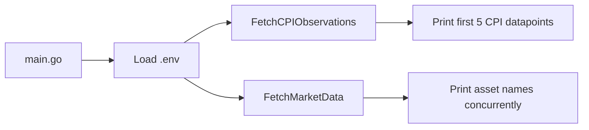
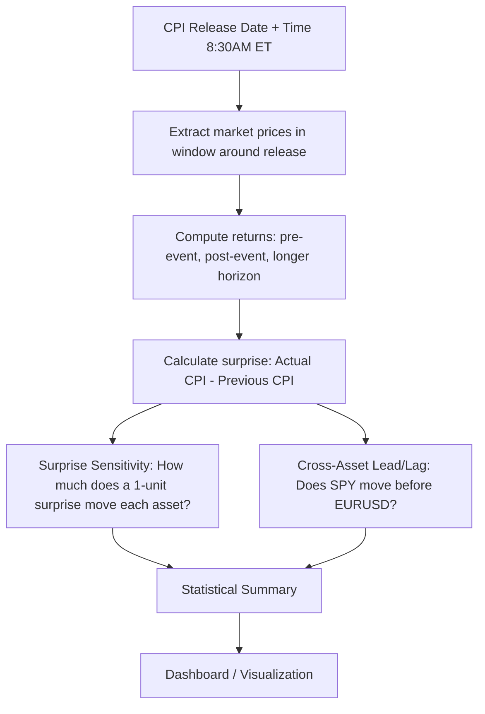

# Real-Time Macro Event Impact Tracker — Walkthrough & Roadmap

## What is This Project?

This is a **Go application** that tracks how **macroeconomic events** (like CPI releases) impact **financial markets** in real time. The core idea:

1. **Fetch macro data** — Pull CPI (Consumer Price Index) observations & release dates from the [FRED API](https://fred.stlouisfed.org/) (Federal Reserve Economic Data).
2. **Fetch market data** — Pull real-time/minute-level prices for assets like SPY, EURUSD, VIX.
3. **Analyze impact** — Around each CPI release, extract a time window of market prices, compute returns, and model how the "surprise" (actual vs. expected) drives price changes.
4. **Output results** — Generate statistical summaries and visualizations.

> [!NOTE]
> The project is in **early-stage development**. The data-fetching foundation is in place, but the analytics engine and output layer are mostly stubs.

---

## Architecture Overview


The system is designed as **four layers**:

| Layer | Purpose | Status |
|---|---|---|
| **MacroLayer** | Fetch CPI observations & release dates from FRED, build `MacroEvent` structs | ✅ Mostly done |
| **MarketLayer** | Load minute-level asset prices, store as time-series | 🟡 Scaffold only |
| **AnalyticsEngine** | Event window extraction, return computation, surprise sensitivity model, cross-asset lead/lag analysis | 🔴 Minimal |
| **OutputLayer** | Statistical summary + visualization/dashboard | 🔴 Not started |

---

## File-by-File Breakdown

### 1. Entry Point

#### [main.go](file:///Users/srijansarkar/Documents/MacroEventImpactTracker/cmd/main.go)

The application entry point. Currently:
- Loads environment variables from `configs/.env` (FRED API key) via `godotenv`
- Calls `macro.FetchCPIObservations()` — fetches historical CPI data and prints the first 5 observations
- Calls `market.FetchMarketData()` — placeholder that prints asset names concurrently



---

### 2. Data Models

#### [event.go](file:///Users/srijansarkar/Documents/MacroEventImpactTracker/internal/models/event.go)

Defines the core `MacroEvent` struct — the central data type that ties a macro release to its market impact:

| Field | Type | Purpose |
|---|---|---|
| `EventName` | `string` | e.g. "CPI Release" |
| `ReleaseDate` | `time.Time` | Exact timestamp of the data release |
| `Actual` | `float64` | The actual reported CPI value |
| `Previous` | `float64` | The prior period's CPI value |

> [!TIP]
> The "surprise" is derived from `Actual - Previous` (or vs. consensus). This is the key driver in macro event studies — markets move based on *unexpected* information.

---

### 3. Macro Data Layer (`internal/macro/`)

#### [fred_series.go](file:///Users/srijansarkar/Documents/MacroEventImpactTracker/internal/macro/fred_series.go)

**Purpose**: Fetches **historical CPI values** from FRED.

- Calls the FRED `series/observations` API with `series_id=CPIAUCSL` (CPI for All Urban Consumers)
- Deserializes JSON into `FredSeriesResponse` → array of `FredObservation{Date, Value}`
- API key is read from the environment variable `FRED_API_KEY`

**Logic**: This gives you the *actual CPI numbers* over time (e.g., CPI was 314.2 on 2024-01-01).

---

#### [fred_release.go](file:///Users/srijansarkar/Documents/MacroEventImpactTracker/internal/macro/fred_release.go)

**Purpose**: Fetches **CPI release dates** from FRED.

- Calls `fred/release/dates` with `release_id=10` (CPI release schedule)
- Returns `FredReleaseResponse` → array of `FredReleaseDate{Date}`

**Logic**: This tells you *when* CPI was announced to the public. Markets react at the moment of release, not when the measurement period ends — so knowing the exact release date is critical.

---

#### [event_builder.go](file:///Users/srijansarkar/Documents/MacroEventImpactTracker/internal/macro/event_builder.go)

**Purpose**: Converts a date string into a precise UTC timestamp for 8:30 AM Eastern Time.

**Logic**: CPI data is always released at **8:30 AM ET** by the Bureau of Labor Statistics. This function:
1. Parses the date string (e.g., `"2026-02-18"`)
2. Sets the time to 08:30:00 in `America/New_York` timezone
3. Converts to UTC for standardized storage

This is essential because the analytics engine will need to extract market price windows *around* this exact moment.

---

#### [fetch.go](file:///Users/srijansarkar/Documents/MacroEventImpactTracker/internal/macro/fetch.go)

**Purpose**: An early prototype/test function (`FetchSampleCPI`) that fetches from a sample API. This was likely a learning exercise and is **not used** in the current `main.go`.

---

### 4. Market Data Layer (`internal/market/`)

#### [fetch.go](file:///Users/srijansarkar/Documents/MacroEventImpactTracker/internal/market/fetch.go)

**Purpose**: Scaffold for concurrent market data fetching.

**Logic**: Uses Go's concurrency primitives:
- `sync.WaitGroup` to track goroutines
- Spawns one goroutine per asset (`SPY`, `EURUSD`, `VIX`)
- Currently only prints asset names — **no actual API calls yet**

> [!IMPORTANT]
> This is the key pattern: each asset is fetched in its own goroutine for maximum throughput. The actual data source (Yahoo Finance, Alpha Vantage, Twelve Data, etc.) is not yet integrated.

---

### 5. Analytics Layer (`internal/analytics/`)

#### [window.go](file:///Users/srijansarkar/Documents/MacroEventImpactTracker/internal/analytics/window.go)

**Purpose**: Single utility function `CalculateReturn(before, after)`.

**Logic**: Standard percentage return formula:
```
return = (after - before) / before
```
This will be used to compute how much each asset moved around a CPI release.

---

### 6. Configuration

#### [configs/.env](file:///Users/srijansarkar/Documents/MacroEventImpactTracker/configs/.env)

Stores the FRED API key. Loaded at startup via `godotenv`.

> [!CAUTION]
> The `.env` file containing the API key is committed to Git. The `.gitignore` correctly lists `configs/.env`, but verify it's not already tracked. Run `git rm --cached configs/.env` if needed.

---

## Logic Summary

The core analytical logic (as envisioned in the architecture) follows a classic **event study** methodology from quantitative finance:



---

## Roadmap — How to Proceed

### Phase 1: Complete the Macro Layer ⏱️ ~1 day

- [ ] **Build `MacroEvent` objects** — Write a function in `event_builder.go` that merges FRED series data + release dates into `[]MacroEvent` structs. For each release date, find the matching CPI observation and the previous one, then populate `Actual` and `Previous`.
- [ ] **Add `Expected`/`Consensus` field** to `MacroEvent` — The "surprise" = Actual − Expected. This could be hardcoded for historical data or fetched from a consensus API later.
- [ ] **Add unit tests** for `BuildReleaseTimestamp` and the event builder.

---

### Phase 2: Real Market Data Integration ⏱️ ~2-3 days

- [ ] **Choose a market data provider** with minute-level granularity:
  - **Free**: Alpha Vantage (limited), Yahoo Finance (unofficial)
  - **Paid**: Twelve Data, Polygon.io, IEX Cloud
- [ ] **Implement actual `FetchAssetPrice(asset, from, to)`** in `internal/market/fetch.go` — fetch minute-level OHLCV data for each asset around each CPI release window (e.g., 30 min before → 2 hours after).
- [ ] **Add a time-series storage model** — Define structs for `MarketDataPoint{Timestamp, Open, High, Low, Close, Volume}` and in-memory storage (or file-based CSV/JSON).
- [ ] **Add Treasury yields** (US 2Y, US 10Y) and DXY to the asset list.

---

### Phase 3: Analytics Engine ⏱️ ~3-4 days

- [ ] **Event Window Extraction** — For each `MacroEvent`, slice the market time-series into windows: `[-30min, 0]`, `[0, +30min]`, `[0, +2h]`, `[0, +1d]`.
- [ ] **Return Computation** — Use `CalculateReturn()` across all windows and assets. Build a return matrix: `[event × asset × window]`.
- [ ] **Surprise Sensitivity Model** — Simple linear regression: `Return = α + β × Surprise + ε`. Compute β for each asset to quantify sensitivity.
- [ ] **Cross-Asset Lead/Lag Analysis** — Calculate cross-correlations between asset returns at different lag offsets (e.g., does VIX spike 1 min before SPY drops?).

---

### Phase 4: Output & Visualization ⏱️ ~2-3 days

- [ ] **Statistical Summary** — Print/export a table with: event date, surprise, returns per asset per window, sensitivity coefficients.
- [ ] **CSV/JSON Export** — Write results to files for external analysis.
- [ ] **Dashboard** — Options:
  - Simple: Go template-based HTML page
  - Rich: Integrate with a frontend (React/Next.js) or use a Go charting library
  - Quickest: Export to CSV and visualize in Python/Jupyter/Streamlit

---

### Phase 5: Production Hardening ⏱️ ~2-3 days

- [ ] **Error handling** — Add retries, rate-limit awareness, and graceful degradation for API calls.
- [ ] **Structured logging** — Replace `fmt.Println` with `log/slog` or `zerolog`.
- [ ] **Configuration** — Move hardcoded values (asset list, windows, API URLs) to a YAML config file.
- [ ] **Caching** — Cache FRED responses locally to avoid redundant API calls during development.
- [ ] **CI/CD** — Add GitHub Actions for `go test`, `go vet`, `golangci-lint`.

---

### Phase 6: Advanced Features (Stretch Goals) 🚀

- [ ] **Real-time mode** — Poll for new CPI releases and trigger analysis automatically.
- [ ] **Multiple macro events** — Add support for Non-Farm Payrolls (NFP), FOMC decisions, GDP, PPI.
- [ ] **Historical backtesting** — Run the full pipeline across all past CPI releases (2015–present).
- [ ] **Alerting** — Notify via Slack/Discord when a large surprise is detected.
- [ ] **Database storage** — Move from in-memory to PostgreSQL/TimescaleDB for persistent time-series.

---

## Recommended Next Step

Start with **Phase 1** — specifically, write the function that merges FRED series + release dates into `[]MacroEvent`. This is the linchpin that connects the data layer to the analytics engine. Once you have structured events, everything else flows naturally.
