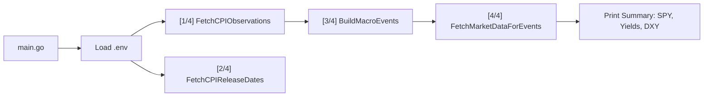
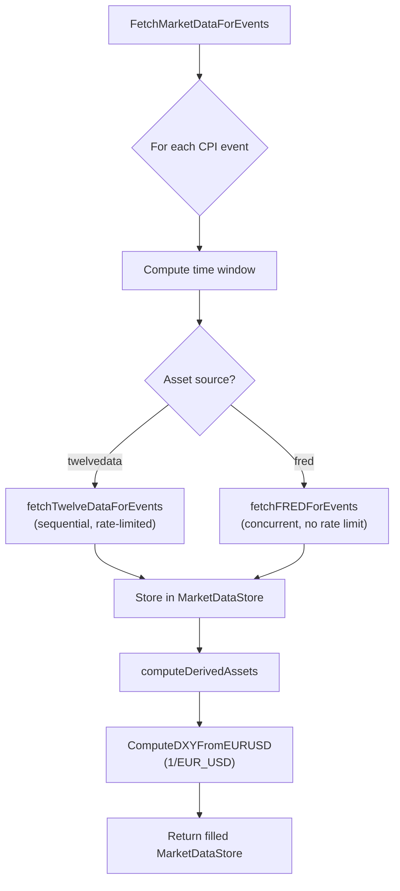
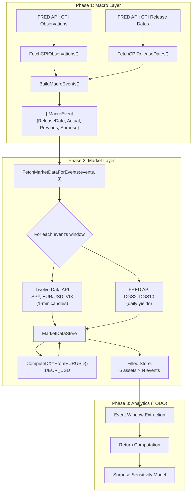
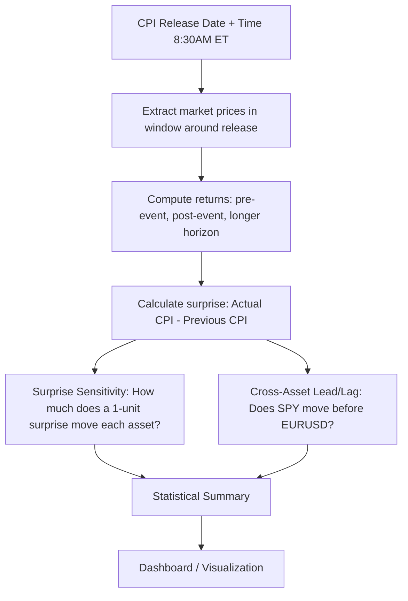

# Real-Time Macro Event Impact Tracker — Walkthrough & Roadmap

## What is This Project?

This is a **Go application** that tracks how **macroeconomic events** (like CPI releases) impact **financial markets** in real time. The core idea:

1. **Fetch macro data** — Pull CPI (Consumer Price Index) observations & release dates from the [FRED API](https://fred.stlouisfed.org/) (Federal Reserve Economic Data).
2. **Fetch market data** — Pull real-time/minute-level prices for assets like SPY, EURUSD, VIX, Treasury yields, and DXY.
3. **Analyze impact** — Around each CPI release, extract a time window of market prices, compute returns, and model how the "surprise" (actual vs. expected) drives price changes.
4. **Output results** — Generate statistical summaries and visualizations.

> [!NOTE]
> **Phase 1** (Macro Layer) and **Phase 2** (Market Data Integration) are complete. The analytics engine and output layer are next.

---

## Architecture Overview


The system is designed as **four layers**:

| Layer | Purpose | Status |
|---|---|---|
| **MacroLayer** | Fetch CPI observations & release dates from FRED, build `MacroEvent` structs | ✅ Done |
| **MarketLayer** | Fetch minute-level asset prices from Twelve Data & FRED, store as time-series | ✅ Done |
| **AnalyticsEngine** | Event window extraction, return computation, surprise sensitivity model, cross-asset lead/lag analysis | 🔴 Minimal |
| **OutputLayer** | Statistical summary + visualization/dashboard | 🔴 Not started |

---

## File-by-File Breakdown

### 1. Entry Point

#### [main.go](file:///Users/srijansarkar/Documents/MacroEventImpactTracker/cmd/main.go)

The application entry point. Runs the full pipeline:
- Loads environment variables from `configs/.env` (FRED + Twelve Data API keys) via `godotenv`
- **Phase 1**: Fetches CPI observations → release dates → builds `MacroEvent` structs
- **Phase 2**: Fetches market data for all assets around the last 3 CPI events, prints summary with SPY candles, Treasury yields, and DXY proxy



---

### 2. Data Models

#### [event.go](file:///Users/srijansarkar/Documents/MacroEventImpactTracker/internal/models/event.go)

Defines the core `MacroEvent` struct — the central data type that ties a macro release to its market impact:

| Field | Type | Purpose |
|---|---|---|
| `EventName` | `string` | e.g. "CPI Release" |
| `ReleaseDate` | `time.Time` | Exact timestamp of the data release |
| `Actual` | `float64` | The actual reported CPI value |
| `Previous` | `float64` | The prior period's CPI value |
| `Expected` | `float64` | Consensus forecast (0 = unknown) |
| `Surprise` | `float64` | Actual - Expected (or Actual - Previous) |

> [!TIP]
> The "surprise" is derived from `Actual - Previous` (or vs. consensus). This is the key driver in macro event studies — markets move based on *unexpected* information.

---

#### [market_data.go](file:///Users/srijansarkar/Documents/MacroEventImpactTracker/internal/models/market_data.go) `[NEW in Phase 2]`

Defines the time-series storage models used by the entire market layer. Three structs work together:

##### `MarketDataPoint` — A Single Candle

| Field | Type | Purpose |
|---|---|---|
| `Timestamp` | `time.Time` | UTC time of this candle |
| `Open` | `float64` | Opening price |
| `High` | `float64` | Highest price during interval |
| `Low` | `float64` | Lowest price during interval |
| `Close` | `float64` | Closing price |
| `Volume` | `int64` | Shares/contracts traded (0 for yields) |

**Why OHLCV?** This is the standard format for financial time-series data. Even Treasury yields (which are a single daily number) are stored as OHLCV with `Open=High=Low=Close=yield_value`. This "uniform shape" means the analytics engine doesn't need to special-case different asset types.

##### `AssetTimeSeries` — One Asset's Price Chart

```go
type AssetTimeSeries struct {
    Symbol     string            // "SPY", "EUR/USD", "DGS10"
    Interval   string            // "1min" or "1day"
    DataPoints []MarketDataPoint // sorted oldest → newest
}
```

Key methods:
- `SortByTime()` — sorts data points chronologically
- `Window(from, to)` — returns a new series containing only points in a date range (used to slice price data around a CPI release)
- `Len()` — returns the count of data points

##### `MarketDataStore` — Thread-Safe In-Memory Storage

```go
type MarketDataStore struct {
    mu   sync.RWMutex                // protects concurrent access
    Data map[string]*AssetTimeSeries // symbol → time series
}
```

**Why thread-safe?** We fetch multiple assets concurrently using goroutines. All goroutines write to this shared store, so we need `sync.RWMutex` to prevent race conditions.

Key methods:
- `Add(symbol, ts)` — stores data; if the symbol already exists, **merges** (appends and re-sorts) rather than replacing. This is crucial because we fetch each event's window separately and they need to be combined.
- `Get(symbol)` — retrieves the full time series
- `GetWindow(symbol, from, to)` — retrieves a time-windowed slice
- `Symbols()` — lists all stored symbols (sorted alphabetically)
- `Summary()` — prints a human-readable overview of all stored data

---

### 3. Macro Data Layer (`internal/macro/`) — Phase 1

#### [fred_series.go](file:///Users/srijansarkar/Documents/MacroEventImpactTracker/internal/macro/fred_series.go)

**Purpose**: Fetches **historical CPI values** from FRED.

- Calls the FRED `series/observations` API with `series_id=CPIAUCSL` (CPI for All Urban Consumers)
- Deserializes JSON into `FredSeriesResponse` → array of `FredObservation{Date, Value}`
- API key is read from the environment variable `FRED_API_KEY`

---

#### [fred_release.go](file:///Users/srijansarkar/Documents/MacroEventImpactTracker/internal/macro/fred_release.go)

**Purpose**: Fetches **CPI release dates** from FRED.

- Calls `fred/release/dates` with `release_id=10` (CPI release schedule)
- Returns `FredReleaseResponse` → array of `FredReleaseDate{Date}`

---

#### [event_builder.go](file:///Users/srijansarkar/Documents/MacroEventImpactTracker/internal/macro/event_builder.go)

**Purpose**: Merges CPI observations + release dates into `[]MacroEvent` structs.

Key functions:
- `BuildReleaseTimestamp(dateStr)` — Converts date string to 8:30 AM ET in UTC
- `BuildMacroEvents(series, releases)` — Uses binary search to match each release date to its CPI observation; computes surprise

---

### 4. Market Data Layer (`internal/market/`) — Phase 2

This is where all the Phase 2 changes live. Four new/rewritten files:

---

#### [fetch.go](file:///Users/srijansarkar/Documents/MacroEventImpactTracker/internal/market/fetch.go) `[REWRITTEN in Phase 2]`

**Purpose**: The orchestrator that coordinates all market data fetching.

**What changed**: The Phase 1 version was a scaffold that just printed asset names concurrently. The Phase 2 version is a full pipeline.

##### `AssetConfig` — What to Fetch

```go
type AssetConfig struct {
    Symbol   string // "SPY", "EUR/USD", "DGS2"
    Source   string // "twelvedata" or "fred"  
    Interval string // "1min" or "1day"
}
```

**Why?** Each asset comes from a different API with different capabilities. `Source` tells the orchestrator which fetcher function to call. `Interval` tells the fetcher what candle granularity to request.

##### `DefaultAssets()` — The Asset List

Returns 5 fetchable assets:

| Symbol | Source | Interval | What It Is |
|---|---|---|---|
| `SPY` | twelvedata | 1min | S&P 500 ETF — broad equity market |
| `EUR/USD` | twelvedata | 1min | Euro/Dollar forex — currency markets |
| `VIX` | twelvedata | 1min | Volatility index — fear gauge |
| `DGS2` | fred | 1day | 2-Year Treasury yield — short-term rates |
| `DGS10` | fred | 1day | 10-Year Treasury yield — long-term rates |

Plus `DXY (proxy)` which is computed from EUR/USD, not fetched directly.

**Why these assets?** They represent the four major reaction channels to CPI data:
- **Equities** (SPY): stocks fall when inflation is hotter than expected (higher rates → lower valuations)
- **Currencies** (EUR/USD, DXY): dollar strengthens on hot CPI (Fed stays hawkish)
- **Volatility** (VIX): spikes on big surprises in either direction
- **Rates** (DGS2, DGS10): yields rise on hot CPI (bond prices fall expecting rate hikes)

##### `FetchMarketDataForEvents(events, maxEvents)` — The Main Orchestrator



**Key design decisions:**

1. **`maxEvents` parameter**: Limits how many CPI events to fetch data for. Set to 3 by default to stay within the Twelve Data free tier (8 req/min). Set to 0 for all events if you have a paid key.

2. **Rate limiting**: Twelve Data's free tier allows 8 API credits per minute. The `rateLimiter` (a `time.Ticker`) enforces at least 8 seconds between Twelve Data calls. FRED has no practical rate limit, so those calls run concurrently.

3. **Time windows**:
   - Intraday assets (SPY, EUR/USD, VIX): `[ReleaseDate - 30min, ReleaseDate + 2h]`
   - Daily assets (DGS2, DGS10): `[ReleaseDate - 5 days, ReleaseDate + 5 days]`

4. **Concurrency pattern**: Same WaitGroup pattern from Phase 1, but now with actual work:
   - FRED assets: each runs in its own goroutine (concurrent)
   - Twelve Data assets: all run in one goroutine that processes sequentially with rate limiting
   - All goroutines share the thread-safe `MarketDataStore`

---

#### [twelvedata.go](file:///Users/srijansarkar/Documents/MacroEventImpactTracker/internal/market/twelvedata.go) `[NEW in Phase 2]`

**Purpose**: Twelve Data API client for minute-level OHLCV data.

**Why Twelve Data?** Free tier gives 800 API calls/day with 1-minute granularity. Covers equities (SPY), forex (EUR/USD), and potentially indices (VIX). Cleaner JSON format than Alpha Vantage.

##### How it works:

1. **Builds the URL**:
   ```
   https://api.twelvedata.com/time_series?symbol=SPY&interval=1min&start_date=2026-01-14 13:00:00&end_date=2026-01-14 15:30:00&outputsize=5000&apikey=KEY
   ```

2. **Parses the response**: The API returns all numeric values as strings (`"520.10000"`), so `parseTwelveDataValues()` converts each field to `float64`/`int64`.

3. **Handles errors**: Twelve Data returns `{"status": "error", "code": 400, "message": "..."}` for bad requests. We check for this and return a descriptive error.

4. **Sorts chronologically**: The API returns newest-first, but our analytics need oldest-first. `SortByTime()` fixes this.

##### JSON response shape:
```json
{
    "meta": {"symbol": "SPY", "interval": "1min"},
    "values": [
        {"datetime": "2026-01-14 09:31:00", "open": "520.10", "high": "520.25", "low": "520.05", "close": "520.15", "volume": "12500"},
        {"datetime": "2026-01-14 09:30:00", "open": "520.00", ...}
    ],
    "status": "ok"
}
```

##### Key function: `parseTwelveDataValues(values, interval)`

This function is where the string-to-number conversion happens. It's designed to be **resilient**:
- If a single candle has a bad timestamp or unparseable price → skip it, don't fail the whole request
- Volume parse errors default to 0 (common for forex pairs)
- Returns an error only if *all* rows fail to parse

---

#### [fred_market.go](file:///Users/srijansarkar/Documents/MacroEventImpactTracker/internal/market/fred_market.go) `[NEW in Phase 2]`

**Purpose**: Fetches daily Treasury yield data from FRED.

**Why a separate file from `internal/macro/fred_series.go`?** Different purpose:
- `macro/fred_series.go` → fetches CPI *inflation* data (what drove the event)
- `market/fred_market.go` → fetches Treasury *yield* data (how markets reacted)

Keeping them separate avoids circular dependencies and keeps each layer focused.

##### How it works:

1. Calls the same FRED `series/observations` endpoint, but with different series IDs:
   - `DGS2` → 2-Year Treasury Constant Maturity Rate
   - `DGS10` → 10-Year Treasury Constant Maturity Rate

2. Converts daily yields into `MarketDataPoint` with `Open=High=Low=Close=yield_value` and `Volume=0`.

**Why set all OHLC to the same value?** Treasury yields are published as a single daily number, not as OHLCV candles. Using the same struct shape means `CalculateReturn()` in the analytics layer works identically for SPY (real OHLCV) and DGS10 (single daily value) — no special-case code needed.

---

#### [dxy.go](file:///Users/srijansarkar/Documents/MacroEventImpactTracker/internal/market/dxy.go) `[NEW in Phase 2]`

**Purpose**: Computes a DXY (US Dollar Index) proxy from EUR/USD data.

**Why not fetch DXY directly?** The real DXY (US Dollar Index) is a proprietary ICE index. It's not available on free-tier APIs like Twelve Data or Alpha Vantage. However, EUR/USD makes up **57.6%** of the DXY weighting, so `1/EUR_USD` gives a strong directional proxy.

##### The math:

```
DXY_proxy = 1 / EUR_USD_close
```

When EUR/USD = 1.10 (each euro buys $1.10), DXY_proxy = 0.909 (dollar is "weaker"). When EUR/USD drops to 1.05, DXY_proxy = 0.952 (dollar is "stronger"). This matches real DXY behavior.

##### OHLCV inversion detail:

```go
DXY.Open  = 1 / EURUSD.Open
DXY.High  = 1 / EURUSD.Low   // ← inverted! EUR low = USD high
DXY.Low   = 1 / EURUSD.High  // ← inverted! EUR high = USD low
DXY.Close = 1 / EURUSD.Close
```

The High/Low swap is because when you invert a fraction, the minimum becomes the maximum and vice versa.

---

### 5. Analytics Layer (`internal/analytics/`)

#### [window.go](file:///Users/srijansarkar/Documents/MacroEventImpactTracker/internal/analytics/window.go)

**Purpose**: Single utility function `CalculateReturn(before, after)`.

**Logic**: Standard percentage return formula:
```
return = (after - before) / before
```
This will be used to compute how much each asset moved around a CPI release.

---

### 6. Configuration

#### [configs/.env](file:///Users/srijansarkar/Documents/MacroEventImpactTracker/configs/.env)

Stores API keys. Loaded at startup via `godotenv`.

```
FRED_API_KEY = your_fred_key
TWELVE_DATA_API_KEY = your_twelve_data_key
```

> [!CAUTION]
> The `.env` file containing API keys is committed to Git. The `.gitignore` correctly lists `configs/.env`, but verify it's not already tracked. Run `git rm --cached configs/.env` if needed.

---

### 7. Tests

#### [event_builder_test.go](file:///Users/srijansarkar/Documents/MacroEventImpactTracker/internal/macro/event_builder_test.go) — Phase 1

13 tests covering `BuildReleaseTimestamp`, `parseObservationValue`, and `BuildMacroEvents`.

#### [fetch_test.go](file:///Users/srijansarkar/Documents/MacroEventImpactTracker/internal/market/fetch_test.go) — Phase 2

10 tests covering:
- `DefaultAssets()` returns all expected assets with correct sources/intervals
- DXY is NOT in the fetchable list (computed, not fetched)
- `MarketDataStore` add/get, merge on duplicate, symbols listing, windowing
- `ComputeDXYFromEURUSD` with known values, nil input, empty data

#### [twelvedata_test.go](file:///Users/srijansarkar/Documents/MacroEventImpactTracker/internal/market/twelvedata_test.go) — Phase 2

5 tests covering:
- Intraday (1min) and daily format parsing
- Empty input error handling
- Skipping bad rows without failing the whole request
- Zero volume for forex pairs

**Total: 28 tests, all passing.**

---

## Data Flow — How Phase 1 + Phase 2 Work Together



---

## Logic Summary

The core analytical logic (as envisioned in the architecture) follows a classic **event study** methodology from quantitative finance:



---

## Roadmap — How to Proceed

### Phase 1: Complete the Macro Layer ✅ Done

- [x] **Build `MacroEvent` objects** — Merges FRED series data + release dates into `[]MacroEvent` structs using binary search.
- [x] **Add `Expected`/`Consensus` field** to `MacroEvent` — defaults to 0, surprise falls back to `Actual - Previous`.
- [x] **Add unit tests** for `BuildReleaseTimestamp` and the event builder (13 tests).

---

### Phase 2: Real Market Data Integration ✅ Done

- [x] **Chose Twelve Data** as the market data provider (free tier: 800 req/day, 1-min granularity)
- [x] **Implemented `FetchMarketDataForEvents()`** — fetches minute-level OHLCV data for each asset around each CPI release window
- [x] **Added time-series storage model** — `MarketDataPoint`, `AssetTimeSeries`, `MarketDataStore` with thread-safe operations
- [x] **Added Treasury yields** (DGS2, DGS10) via FRED and **DXY proxy** via EUR/USD inversion
- [x] **15 new unit tests** — all passing

---

### Phase 3: Analytics Engine ⏱️ ~3-4 days

- [ ] **Event Window Extraction** — For each `MacroEvent`, slice the market time-series into windows: `[-30min, 0]`, `[0, +30min]`, `[0, +2h]`, `[0, +1d]`.
- [ ] **Return Computation** — Use `CalculateReturn()` across all windows and assets. Build a return matrix: `[event × asset × window]`.
- [ ] **Surprise Sensitivity Model** — Simple linear regression: `Return = α + β × Surprise + ε`. Compute β for each asset to quantify sensitivity.
- [ ] **Cross-Asset Lead/Lag Analysis** — Calculate cross-correlations between asset returns at different lag offsets (e.g., does VIX spike 1 min before SPY drops?).

---

### Phase 4: Output & Visualization ⏱️ ~2-3 days

- [ ] **Statistical Summary** — Print/export a table with: event date, surprise, returns per asset per window, sensitivity coefficients.
- [ ] **CSV/JSON Export** — Write results to files for external analysis.
- [ ] **Dashboard** — Options:
  - Simple: Go template-based HTML page
  - Rich: Integrate with a frontend (React/Next.js) or use a Go charting library
  - Quickest: Export to CSV and visualize in Python/Jupyter/Streamlit

---

### Phase 5: Production Hardening ⏱️ ~2-3 days

- [ ] **Error handling** — Add retries, rate-limit awareness, and graceful degradation for API calls.
- [ ] **Structured logging** — Replace `fmt.Println` with `log/slog` or `zerolog`.
- [ ] **Configuration** — Move hardcoded values (asset list, windows, API URLs) to a YAML config file.
- [ ] **Caching** — Cache FRED responses locally to avoid redundant API calls during development.
- [ ] **CI/CD** — Add GitHub Actions for `go test`, `go vet`, `golangci-lint`.

---

### Phase 6: Advanced Features (Stretch Goals) 🚀

- [ ] **Real-time mode** — Poll for new CPI releases and trigger analysis automatically.
- [ ] **Multiple macro events** — Add support for Non-Farm Payrolls (NFP), FOMC decisions, GDP, PPI.
- [ ] **Historical backtesting** — Run the full pipeline across all past CPI releases (2015–present).
- [ ] **Alerting** — Notify via Slack/Discord when a large surprise is detected.
- [ ] **Database storage** — Move from in-memory to PostgreSQL/TimescaleDB for persistent time-series.

---

## How to Run

```bash
# 1. Set up API keys in configs/.env
#    FRED_API_KEY = your_fred_key
#    TWELVE_DATA_API_KEY = your_twelve_data_key (get free at https://twelvedata.com)

# 2. Run tests
/usr/local/go/bin/go test ./... -v

# 3. Run the application
/usr/local/go/bin/go run cmd/main.go
```

## Recommended Next Step

Start with **Phase 3** — specifically, build the event window extraction. You now have `MarketDataStore.GetWindow(symbol, from, to)` ready to slice price data around each CPI release. The next step is computing returns across each window and building the return matrix.
